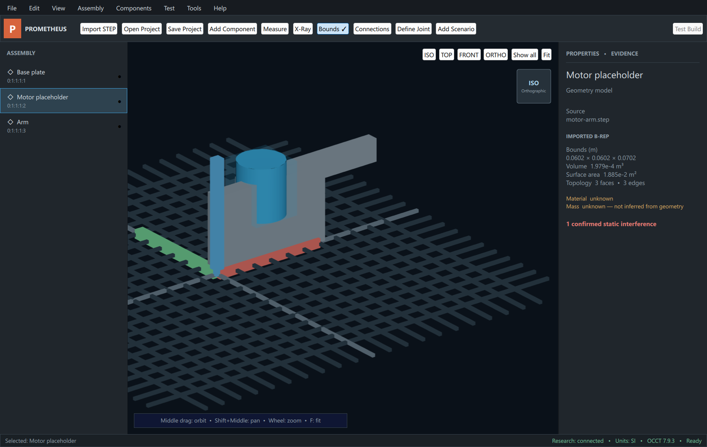

# Prometheus

Product goal: Prometheus is a local project compiler and solver-orchestration environment for heterogeneous engineering projects. It is intended to inventory project files, reconstruct a reviewable system model, compile requirements and scenarios into proof obligations, run bounded local analyses, and report failures, scoped successes, unknowns, and coverage with reproducible provenance.

Current repository: this codebase is a fixture-backed electromechanical vertical demonstrator plus the Program 01A trust contracts. It cannot determine whether an arbitrary engineering project works.



## What is implemented

- The Windows Qt/C++ desktop imports real STEP/XDE through Open Cascade, preserves hierarchy and persistent entity IDs, renders tessellation, supports inspected part placement, and performs exact static or sampled collision operations where explicitly labeled.
- A separate synthetic motor-arm assembly remains available for deterministic conformance tests. Real STEP import and the synthetic motor fixture are different paths.
- The versioned Python service performs exact lookup of one checked-in synthetic component, `Prometheus Fixture Works / PM-36-GM`. It does not search the web, parse public datasheets, or run an LLM research provider.
- Component parameters have typed values and source-linked evidence. Publication requires one explicit human decision per field and produces a canonical, hash-verifiable execution-component package.
- The package declares `prometheus_cpp` as the engineering decision authority, but the current C++ motor-arm checker does not consume it. Connecting reviewed package values to C++ is the Program 01B exit gate.
- The fixed C++ motor-arm calculations are a conformance demonstrator for torque, current, a one-node thermal model, and selected geometry checks. They are not evidence of arbitrary mechanical or cross-domain engineering support.
- The old Python research-confirm-plan-run path is retired. Its trust-sensitive endpoints return structured `410` or `501` errors, and no production route imports the historical Python physics module.
- The React rough-V1 interface is retained as a labeled, non-executing geometry viewer.

No external structural, thermal, electrical, CFD, or controls solver adapter exists yet. The repository makes no certification claim and no project-wide correctness claim. A failed, missing, nonconverged, or unsupported analysis must remain `indeterminate` or `not_evaluated`; it cannot become a pass.

The [master roadmap](docs/program/00-master-roadmap.md) defines the gates from this trust kernel to general project intake, a semantic engineering graph, proof-obligation planning, a local solver SDK, six bounded domain slices, validation, and product hardening.

## Program 01A status

[Program 01A: integrity and contracts](docs/program/01-trust-kernel/01a-integrity-and-contracts.md) records the implemented behavior, verification evidence, and remaining limits. Its main artifacts are:

- exact fixture provenance and no caller-controlled source attribution;
- typed engineering-value, evidence, execution-component, and finding contracts;
- atomic per-field review and publication;
- canonical execution-package hashing and tamper detection;
- an explicit Qt review/publish state machine;
- retired non-authoritative Python verdict routes;
- checked-in OpenAPI that must exactly match the application.

Program 01A creates a trustworthy input boundary. Program 01B must prove that two reviewed packages drive different expected C++ results and reproduce after offline reopen.

## Prerequisites

The documented native path targets Windows 11 with:

- MSYS2 UCRT64 with GCC, Qt 6.5+, and Open Cascade;
- CMake 3.24+ and Ninja;
- a Python 3.11+ environment with `uv` for the backend;
- Node 20+ for the archived frontend.

Open Cascade is enabled by the Windows native preset. MuJoCo is optional and uninstalled; it is not a current Prometheus analysis backend.

## Verify the repository

On the documented PowerShell environment:

```powershell
./scripts/bootstrap.ps1
./scripts/verify.ps1
```

The verification script runs the backend tests, frontend tests/build/audit, and headless C++ tests. Headless verification does not exercise the Qt review UI or Open Cascade adapter. Native Windows verification requires the separate `windows-debug` configure/build/test sequence documented in Program 01A.

## Run the native desktop

After installing the UCRT64 dependencies described in `scripts/bootstrap-native.ps1`:

```powershell
cmake --preset windows-debug
cmake --build --preset windows-debug
ctest --preset windows-debug --output-on-failure
./out/build/windows-debug/desktop/app/prometheus_desktop.exe
```

Set `PROMETHEUS_DEMO_RESEARCH=1` only to open the exact synthetic fixture for manual review. There is no auto-accept or auto-publish switch.

## Run the versioned service

```powershell
./scripts/run-services.ps1
```

The health endpoint is `GET http://127.0.0.1:8000/v1/health`. Trusted component intake uses `/v1/research-jobs`, explicit `/review`, separate `/publish`, and the published `/v1/component-revisions/{revision_id}/execution-package` export. The unversioned evidence and analysis mutation routes are retired rather than redirected into the trusted store.

## Archived React viewer

```powershell
cd frontend
npm ci
npm run dev
```

Open `http://localhost:5173` with the service running. The page can load the local fixture geometry; component research and engineering execution are visibly disabled.

## Design and policy

- [Approved compiler/solver architecture](docs/superpowers/specs/2026-08-11-prometheus-general-engineering-platform-design.md)
- [Architecture boundary](docs/architecture.md)
- [Authoritative analysis backends](docs/adr/0006-authoritative-analysis-backends.md)
- [Product scope](docs/product-scope.md)
- [Release status](docs/rough-v1-release-status.md)
- [Validation policy](docs/validation-policy.md)
- [Threat model](docs/threat-model.md)
