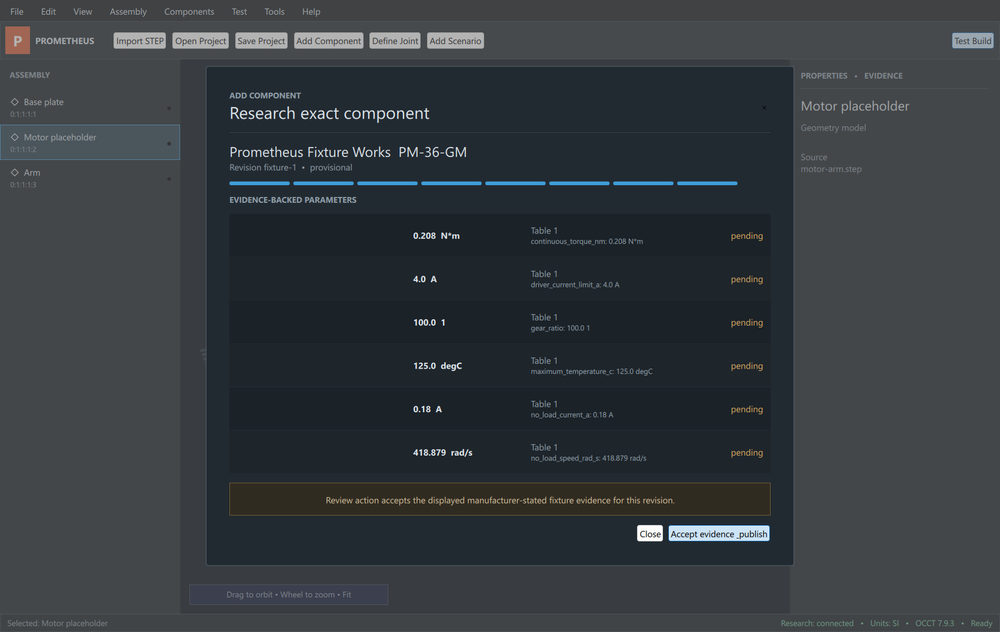
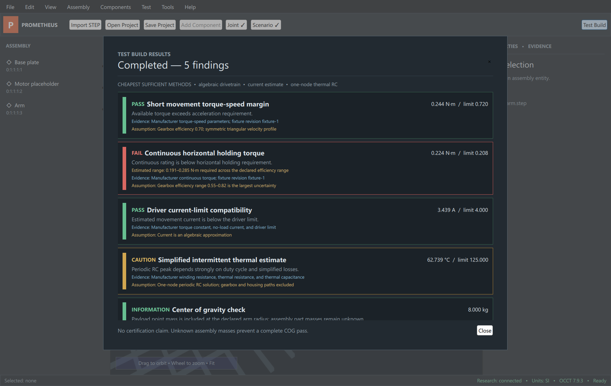

# Prometheus

Prometheus is an evidence-driven compiler and debugger for small electromechanical products. The target V1 is a C++20/Qt 6 desktop engineering core with Open Cascade CAD ingestion and a Python component-research service.

> **Rough V1 / engineering preview:** Prometheus catches a useful subset of early design errors, but it is not a certification tool and does not replace physical testing or professional review.


| Evidence review | Engineering findings |
| --- | --- |
|  |  |

## Repository status

Milestones 0–15 have implemented vertical paths. The native Qt/QML shell imports real STEP/XDE, researches and publishes an evidence-backed fixture component, binds it to a part, confirms a revolute joint, compiles the motor-arm scenario, and produces deterministic geometry/torque/current/thermal/partial-COG findings. Project reopen preserves component, joint, scenario, findings, semantic connections, overlap classifications, and precise part translation/rotation.

The CAD viewport includes conventional orbit/pan/zoom, perspective and orthographic projection, standard views and shortcuts, lit tessellation, X-Ray, bounds/topology inspection, SI measurement, continuously draggable world/local-axis placement, snapping, transient dimensions, undo/redo, bounds-anchor snap-to-mate, joint-axis display, exact OCCT static interference, and asynchronous sampled joint-range collision checking.

Qt and Open Cascade are installed through the documented MSYS2 UCRT64 bootstrap path on the current development machine. MuJoCo remains optional and uninstalled. Headless contract/core verification does not require these large native packages.

The exact implemented, mocked, partial, and unsupported boundaries are tracked in [Rough V1 release status](docs/rough-v1-release-status.md).

For a high-detail external demo, see the licensed [OpenArm 2.0 stress-test workflow](docs/external-openarm-demo.md).

## Windows 11 prerequisites

- MSYS2 UCRT64 with GCC, Qt 6, and Open Cascade (current verified path), or a future pinned MSVC-equivalent toolchain
- CMake 3.24+
- Ninja
- Qt 6.5+ (set `Qt6_DIR` or `CMAKE_PREFIX_PATH`)
- Python 3.12-compatible runtime and `uv`
- Node 20 for the reference frontend

Open Cascade is enabled by the Windows native preset. MuJoCo remains a later optional adapter and its absence does not block the current build.

## Bootstrap and verify

```powershell
.\scripts\bootstrap.ps1
.\scripts\verify.ps1
```

The single verification command runs Python unit/integration/contract tests, reference frontend tests/build/audit, and the native headless C++ build/tests.

## Native desktop

After installing the UCRT64 dependencies described in `scripts/bootstrap-native.ps1`:

```powershell
cmake --preset windows-debug
cmake --build --preset windows-debug
.\out\build\windows-debug\desktop\app\prometheus_desktop.exe
```

For headless CI or a machine without Qt:

```powershell
cmake --preset headless-debug
cmake --build --preset headless-debug
ctest --preset headless-debug
```

## Research service

```powershell
.\scripts\run-services.ps1
```

The versioned health endpoint is `GET http://127.0.0.1:8000/v1/health`. The unversioned prototype API remains temporarily available during migration.

## Reference prototype

```powershell
cd frontend
npm install
npm run dev
```

Open `http://localhost:5173` with the research service running. This fixture path requires no API key.

See [architecture](docs/architecture.md), [product scope](docs/product-scope.md), [validation policy](docs/validation-policy.md), and [threat model](docs/threat-model.md).
